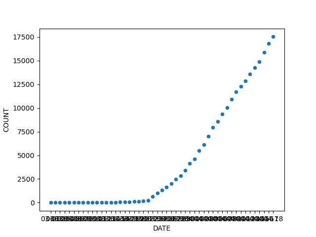
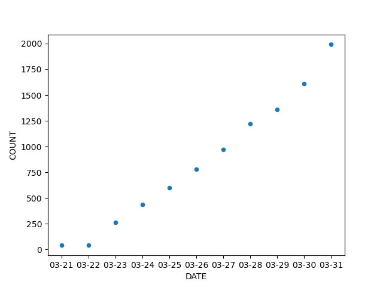

# COVID-19 Quebec
Collection of cases from the [Quebec government site](https://www.quebec.ca/sante/problemes-de-sante/a-z/coronavirus-2019/situation-coronavirus-quebec/), French version. (Note: English version is not updated as frequently.)

## Graphs
### Quebec Cases

### Montreal Cases

## Note

03/22 : The number of deaths related to COVID-19 is lower than what was announced on March 21, 2020. The test of one of these people was negative.

03/23 : The significant increase in confirmed cases is explained by the fact that on March 22, 2020, cases tested positive by hospital laboratories are now considered confirmed. They no longer need validation by the Laboratoire de santé publique du Québec (LSPQ).